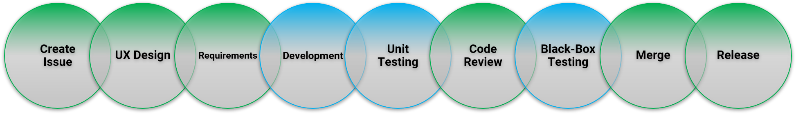

# Contributing to Carbon

Thanks for contributing to Carbon! :1st_place_medal: :1st_place_medal:

-   [Contributing to Carbon](#contributing-to-carbon)
    -   [Code of Conduct](#code-of-conduct)
    -   [Consumers](#consumers)
    -   [Developers](#developers)
        -   [Development](#development)
            -   [Pulling in dependencies](#pulling-in-dependencies)
            -   [Building the project](#building-the-project)
        -   [Code Review](#code-review)
            -   [Pull Request checklist](#pull-request-checklist)
            -   [Commit message format](#commit-message-format)
            -   [Pull Request](#pull-request)
        -   [Release](#release)
        -   [Deploying the site to GitHub](#deploying-the-site-to-github)
    -   [Breaking changes](#breaking-changes)

This project uses NPM for dependency management and provides NPM scripts to call on `Webpack` to run tasks on the project.
To get started, you will need to checkout this project.

## Code of Conduct

Carbon adheres to the [JS Foundation Code of Conduct](https://js.foundation/community/code-of-conduct).

## Consumers

We use `Github` issues for tracking. Use appropriate queue `Bug` or `Feature Request` for reporting.

## Developers

We try to make process as simple as possible:



Before starting development on a Carbon project, please complete the following steps:

1. If contribution involves changes to `requirements`, create your work in the Carbon JIRA project using the appropriate template:
    - <a href="https://jira3.cerner.com/browse/CARBON-1/">Enhancement</a>
    - <a href="https://jira3.cerner.com/browse/CARBON-2/">Defect</a>
2. For contributions that have an issue in the Github queue, you don't have to do anything specific!

### Development

#### Pulling in dependencies

After checking out the project, you will want to run the following command to pull in dependencies needed by the project:

```sh
npm install
```

When contributing to Carbon, you would need to run the below command and load the test page. The test page auto reloads whenever you make any changes to the .CSS, .JS files or if you make any changes to the sample .html file

```sh
npm run dev
```

Open in browser:

```sh
http://localhost:9991/
```

#### Building the project

To build the project, run the build script:

```sh
npm run build && npm run build:dist
```

This will generate `dist` and `lib` folders with `core + packaged dependencies` and `core` source codes respectively.

### Code Review

#### Pull Request checklist

-   Follow the [UX Design Standards](https://wiki.ucern.com/display/UserExperience/Standard+Graphs).
-   Setup a design meeting to discuss overall design of the project.
-   Add the code changes.
-   Add unit tests.
-   Ensure your code is thoroughly unit tested. (Coverage is at `carbon-graphs\.coverage\html\index.html`)
-   Ensure no unit tests are broken.
-   Ensure no linting errors are present.
-   Add examples in appropriate tab within `dev`.
-   Write documentation in `Markdown`, following the existing documentation pattern.
-   Include screenshots and animated GIFs in your **pull request** whenever possible.
-   Follow proper PR title and Commit message [format](#commit-message-format).
-   End files with a newline.

#### Commit message format

We follow `ESLint` [commit convention](https://eslint.org/docs/1.0.0/developer-guide/contributing#step-2-make-your-changes).
Your commit message should look something like this:

```text
<Tag>: <Short description> (fixes #1234)
```

**Note**:
1234 is the Carbon [Github issue](https://github.com/cerner/carbon-graphs/issues/237) number.

#### Pull Request

-   Provide the PR with all necessary information to ease code review process in the `Description`, for instance:
    -   Screenshots of the working prototype.
    -   Files you want the reviewer to focus on.
-   Respond to all comments.
-   Do **not** rebase with main and force push until you reach `ready to merge` status.

### Release

Release is automated, and will be performed when PR is merged to `main` branch.

carbon-graphs will be released following release types based on the commit message tags

|   Tag    | Release |
| :------: | :-----: |
| Breaking |  major  |
|   Fix    |  patch  |
|   New    |  minor  |
|  Update  |  minor  |
| Upgrade  |  patch  |
|  Revert  |  patch  |

### Deploying the site to GitHub

Deployment of site is automated, and will be performed when PR is merged to `main` branch.

## Breaking changes

For any breaking changes, add information on how to migrate from previous version along with changes that was provided.
Create an issue and add any stakeholders to that issue.
This issue will be closed once you have :+1: from all of the stakeholders (or subsequent issues are created within their own git repo queues).
