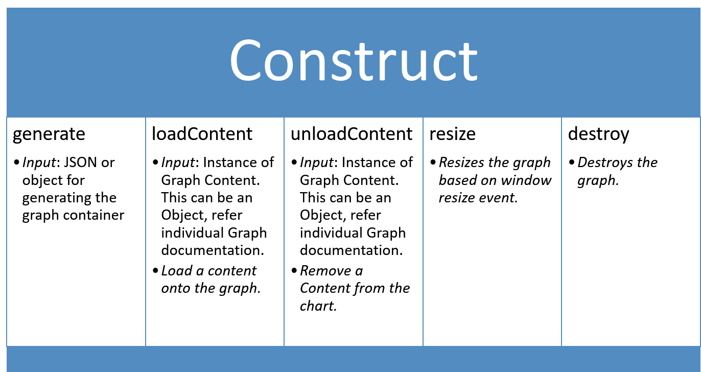

# Carbon Interface

For a consistent development experience Carbon uses the same underlying interface for all graph types. All Carbon graphs are separated into 2 parts: `Construct` & `GraphContent`.

-   [Carbon Interface](#carbon-interface)
    -   [Construct](#construct)
    -   [GraphContent](#graphcontent)
    -   [Important information](#important-information)

## Construct

`Construct` is the base for `GraphAPI` and other types of graph that serves as a container for the content. Usually this takes care of one or more of the following:

-   X Axis
-   Y Axis
-   Vertical Grid
-   Horizontal Grid
-   X Axis labels
-   Y Axis labels
-   Legend

An input Object/JSON is provided to draw the `Construct` before drawing the content.

## GraphContent

`GraphContent` is the representation of the data-set drawn within the `Construct`. For instance, for `Line` graph, the `Construct` is the Axes, Labels and Legend while the `GraphContent` is the line itself.
Separation of container and content allows us to:

-   Render multiple `GraphContent`s within a single `Construct`.
-   Draw different combinations of graphs i.e. we can draw a _Combination graph_ with _2 Bar graphs_ or _1 Bar graph_ and _1 line graph_ without ever needing to building those natively in Carbon.
-   Draw different combinations of graph in any order necessary.

## Important information

Only graphs that share the same rules of `Construct` can be combined together.

For instance:

-   A `Gantt` chart cannot be combined with a `Line` graph -> `Line` needs a X and Y axis whereas `Gantt` chart Construct only has X Axis when drawn.
-   A `Timeline` graph cannot be combined with a `Line` graph -> `Line` needs a X and Y axis whereas `Timeline` graph doesnt have a Y Axis.
-   `Line` graph can be combined with a `Bar` or `Paired Result`.
